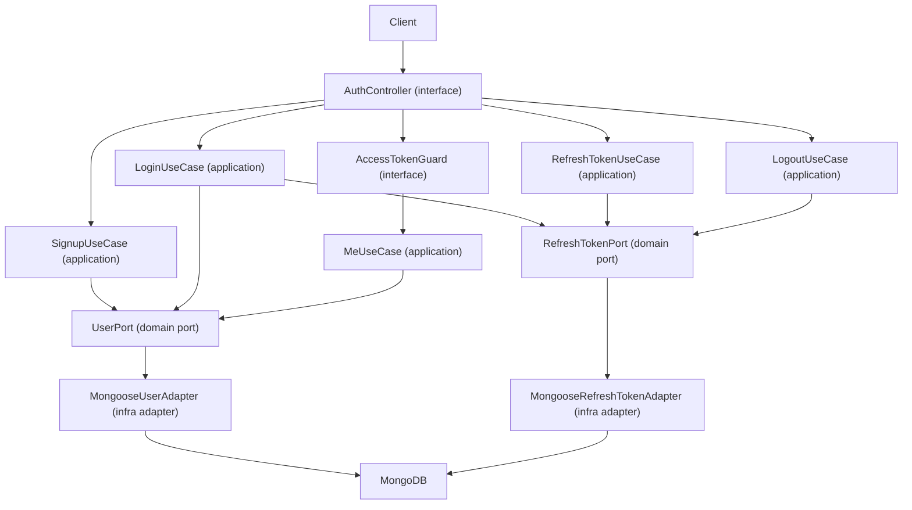

## Auth API Architecture (`apps/api-auth`)

This document describes the architecture and conventions of the
`apps/api-auth` service and serves as instructions for an AI agent extending
this app.

---

### High-Level Overview

- **App type**: NestJS HTTP API
- **Primary purpose**: authentication and session-token service
- **Current responsibilities**:
  - Signup and login
  - Access token issuance (JWT)
  - Refresh token verification against persisted hash
  - Logout (refresh token invalidation)
  - Authenticated profile endpoint (`/auth/me`)
  - User + refresh token persistence in MongoDB



---

### Tech Stack (Current)

- **Framework**: NestJS 11
- **Data layer**: Mongoose + MongoDB
- **Auth**: `@nestjs/jwt` + `jsonwebtoken`
- **Crypto**: `bcrypt`
- **Boundary validation**: Zod pipes on request bodies
- **Testing**: Jest + Supertest

---

### Directory Structure

```bash
apps/api-auth/src
├─ main.ts
├─ app.module.ts
├─ common/
│  └─ env.ts
└─ auth/
   ├─ domain/
   │  ├─ entities/
   │  ├─ ports/
   │  └─ value-objects/
   ├─ application/
   │  └─ use-cases/
   ├─ interface/
   │  ├─ dto/
   │  ├─ http/
   │  └─ pipes/
   ├─ infra/
   │  ├─ mappers/
   │  └─ mongoose/
   │     ├─ adapters/
   │     └─ schemas/
   └─ auth.module.ts
```

Agent rules for structure:

- Keep `domain`, `application`, `interface`, and `infra` separate.
- Keep env helpers centralized in `common/env.ts`.
- Add new persistence providers under `infra/*/adapters`.

---

### Architecture Style

- **Clean Architecture with Ports & Adapters**
  - Domain defines contracts (`UserPort`, `RefreshTokenPort`) and VOs.
  - Application implements use-case orchestration.
  - Interface handles HTTP mapping, guards, and pipes.
  - Infra implements persistence with Mongoose adapters.

Dependency direction must remain inward:

- `interface -> application -> domain`
- `infra -> domain` (port implementations)

---

### Domain Model & Boundary Invariants

Current domain primitives:

- Entity: `User`
- Value Objects:
  - `Email`
  - `Password`
  - `UserId`
- Ports:
  - `UserPort`
  - `RefreshTokenPort`

Boundary validation strategy:

- HTTP body validation uses Zod pipes (`signup`, `login`, `refresh`).
- Use cases also enforce invariants via VOs before orchestration.

Agent instructions:

- Keep all user input validated at boundary and at VO construction.
- Never leak Mongoose documents outside infra.

---

### Application Layer (Use Cases)

Implemented use-cases:

- `SignupUseCase`
- `LoginUseCase`
- `RefreshTokenUseCase`
- `LogoutUseCase`
- `MeUseCase`

Current token behavior:

- Login issues `accessToken` + `refreshToken`.
- Refresh validates refresh JWT and persisted hash, then returns **new access token**.
- Logout verifies refresh JWT and deletes persisted hash record.

Note for future extension:

- If refresh-token rotation is reintroduced, update both use-case behavior and
  this document.

---

### Interface Layer (HTTP + Pipes + Guard)

Routes under `/auth`:

- `POST /auth/signup`
- `POST /auth/login`
- `POST /auth/refresh`
- `POST /auth/logout`
- `GET /auth/me` (protected by `AccessTokenGuard`)

Boundary adapters:

- `SignupBodyPipe`, `LoginBodyPipe`, `RefreshTokenBodyPipe` (Zod strict schemas)
- `AccessTokenGuard` validates bearer token with `JWT_SECRET`

Agent instructions:

- Controllers must remain thin and orchestration-free.
- New input models should get dedicated DTO + Zod pipe.

---

### Infra Layer (Mongoose Adapters)

Persistence adapters:

- `MongooseUserAdapter` implements `UserPort`
- `MongooseRefreshTokenAdapter` implements `RefreshTokenPort`

Schemas:

- `User`
- `RefreshToken` (`userId` is unique/indexed)

Mapping:

- `userMapper` maps between persistence shape and domain entity.

Agent instructions:

- Any schema evolution must be reflected in adapters and mapper together.
- Keep persistence-specific fields from leaking into domain contracts.

---

### Security Decisions

Current enforced controls:

- Passwords compared with bcrypt hashes
- Refresh tokens stored as bcrypt hash only
- Generic invalid-credential response
- Access token guard on private endpoint (`/auth/me`)
- Fail-fast env requirements for JWT secrets/expirations

Operational notes:

- Observability hooks are intentionally TODO comments at critical auth failures.

---

### Configuration (Required Env)

Required envs include:

- `PORT`
- `MONGO_URI`
- `JWT_SECRET`
- `JWT_EXPIRES_IN`
- `JWT_REFRESH_SECRET`
- `JWT_REFRESH_EXPIRES_IN`

Agent instructions:

- Do not add fallback defaults for required auth env vars.
- Keep startup and provider config fail-fast.

---

### Testing Strategy

Current test coverage focuses on:

- Use-cases: signup/login/refresh/logout
- Controller integration flow (signup -> login -> me -> refresh -> logout)
- Validation rejection for unknown body fields

Agent instructions:

- Add tests for any change in token lifecycle or guard behavior.
- Keep integration tests for end-to-end auth flow consistency.

---

### How the Agent Should Add a New Auth Feature

1. Add/extend domain VO/entity/port contract as needed
2. Add or adjust application use case
3. Add HTTP DTO + Zod body pipe (if new boundary)
4. Wire endpoint in `AuthController`
5. Implement/extend infra adapter if persistence is involved
6. Add unit + integration tests

Never couple controllers directly to Mongoose models.

---

### Do & Don’t Summary

- **Do**
  - Keep ports/adapters boundaries explicit
  - Validate body input with Zod and domain VOs
  - Keep refresh-token hashes persisted and revocable
  - Use fail-fast env helpers
  - Keep controller logic thin
- **Don’t**
  - Don’t expose persistence documents in interface/application layers
  - Don’t add endpoint logic directly into guards
  - Don’t store refresh tokens in plain text
  - Don’t add silent fallback secrets/expirations
