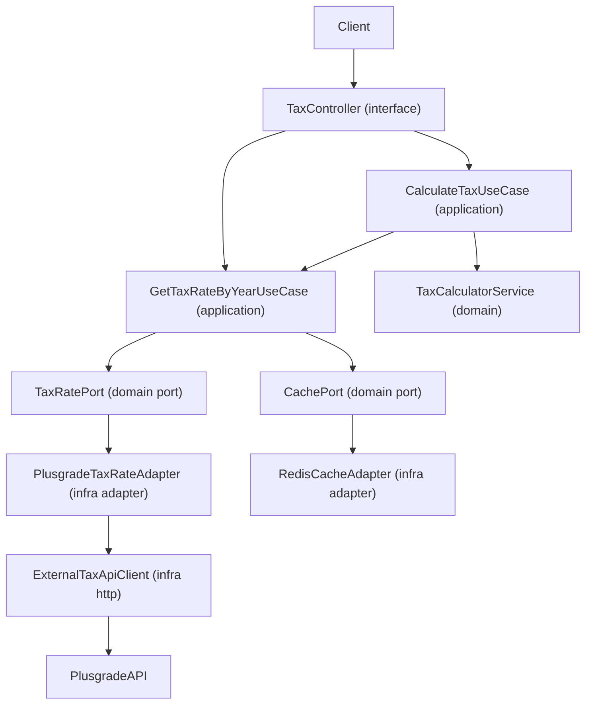

## Tax API Architecture (`apps/api-tax`)

This document describes the architecture and conventions of the `apps/api-tax`
service and serves as instructions for an AI agent extending this app.

---

### High-Level Overview

- **App type**: NestJS HTTP API
- **Primary purpose**: intermediate tax-calculation API over Plusgrade endpoints
- **Core responsibilities**:
  - Fetch brackets for supported tax years
  - Calculate total tax, effective rate, and taxes by band
  - Handle random upstream failures (especially year `2022`)
  - Cache tax rates using Redis with cache-aside pattern



---

### Tech Stack (Current)

- **Framework**: NestJS 11
- **HTTP client**: Axios
- **Cache**: Redis (`ioredis`)
- **Testing**: Jest + Supertest
- **Runtime model**: strict env validation (fail-fast)

---

### Directory Structure

```bash
apps/api-tax/src
├─ main.ts
├─ app.module.ts
└─ tax/
   ├─ domain/
   │  ├─ ports/
   │  ├─ services/
   │  └─ value-objects/
   ├─ application/
   │  └─ use-cases/
   ├─ interface/
   │  ├─ dto/
   │  ├─ http/
   │  └─ pipes/
   ├─ infra/
   │  ├─ plusgrade/
   │  │  ├─ adapters/
   │  │  └─ http/
   │  └─ redis/
   │     └─ adapters/
   └─ tax.module.ts
```

Agent rules for structure:

- Keep **domain/application/interface/infra** boundaries explicit.
- Do not bypass ports with direct infra calls from controller/use case.
- New external integrations must live under `infra/*`.

---

### Architecture Style

- **Clean Architecture**:
  - Domain owns invariants and contracts.
  - Application orchestrates use-cases.
  - Interface maps HTTP input/output.
  - Infra implements ports.
- **Ports & Adapters**:
  - `TaxRatePort` is implemented by `PlusgradeTaxRateAdapter`.
  - `CachePort` is implemented by `RedisCacheAdapter`.

Dependency direction must remain inward:

- `interface -> application -> domain`
- `infra -> domain` (via port implementation)

---

### Domain Model & Invariants

The domain is VO-first and validates at creation:

- `TaxYear`: only supported years (`2019` to `2022`)
- `Salary`: must be `>= 0`
- `TaxBracket`: validates bracket boundaries and rate range
- `TaxRate`: year + list of `TaxBracket`; supports snapshot conversion

Agent instructions:

- Introduce new tax concepts as VOs before adding primitive fields in use-cases.
- Keep domain logic free from NestJS, Redis, Axios, or HTTP details.

---

### Application Layer (Use Cases)

- `GetTaxRateByYearUseCase`:
  - Implements cache-aside logic
  - Reads cache first (`tax-rate:<year>`)
  - Falls back to `TaxRatePort` adapter
  - Writes snapshot back to cache with env TTL
- `CalculateTaxUseCase`:
  - Retrieves tax rate through the use case above
  - Delegates tax math to `TaxCalculatorService`
  - Returns API-friendly calculation response

Agent instructions:

- Use cases should orchestrate, not parse HTTP or call raw framework services.
- Reuse `GetTaxRateByYearUseCase` for any feature needing tax rates.

---

### Interface Layer (HTTP + Pipes)

Controller routes:

- `GET /tax-calculator/tax-year/:year`
- `GET /tax-calculator/tax-year/:year/salary/:salary`

Boundary validation:

- `YearParamPipe` maps/validates route param to `TaxYear`
- `SalaryParamPipe` maps/validates route param to `Salary`

Agent instructions:

- Keep controller thin: validate, call use case, return DTO-compatible payload.
- For new endpoints, validate input at boundary and convert to VO early.

---

### Infra Layer

#### Plusgrade Adapter + HTTP Client

- `PlusgradeTaxRateAdapter` maps external payload to domain `TaxRate`.
- `ExternalTaxApiClient`:
  - Reads all required env vars at startup
  - Applies retry + linear backoff by attempt count
  - For `2022`, uses fallback endpoint `/tax-calculator/` when retries fail
  - Throws `BadGatewayException` or `ServiceUnavailableException` based on failure mode

#### Redis Adapter

- `RedisCacheAdapter` implements `CachePort`
- Stores JSON snapshots with explicit TTL
- Reads `REDIS_URL` via fail-fast env helper

---

### Cache-Aside Pattern (Implemented)

Flow used in `GetTaxRateByYearUseCase`:

1. Build cache key from year
2. Try Redis
3. Cache miss -> call `TaxRatePort`
4. Convert to snapshot and cache with TTL
5. Return domain object

This is the canonical pattern for read-mostly tax-rates in this service.

---

### Error Handling & Resilience

- Invalid boundary input -> `400` via pipes/VO construction
- Missing tax rates -> `404` from calculate use case
- Upstream errors:
  - 4xx from external API -> `502 Bad Gateway`
  - unavailability/timeouts -> `503 Service Unavailable`
- Startup/config errors -> fail-fast and process exit in bootstrap
- Observability integrations are intentionally TODO placeholders

---

### Configuration (Required Env)

Expected runtime envs include:

- `PORT`
- `PLUSGRADE_TAX_API_BASE_URL`
- `PLUSGRADE_API_TIMEOUT_MS`
- `PLUSGRADE_API_MAX_RETRIES`
- `PLUSGRADE_API_RETRY_BACKOFF_MS`
- `TAX_RATE_CACHE_TTL_SECONDS`
- `REDIS_URL`

Agent instructions:

- Do not add fallback defaults in code for required env vars.
- Keep config parsing explicit and fail-fast.

---

### Testing Strategy

Current test areas:

- Domain service tax calculations
- HTTP controller integration behavior
- External client retry/fallback behavior

Agent instructions:

- Add tests whenever behavior changes in:
  - tax math
  - fallback/retry strategy
  - HTTP contract
- Prefer deterministic tests around scenario tables (salary/year expectations).

---

### How the Agent Should Add a New Tax Feature

1. Identify if change belongs to **domain**, **application**, **interface**, or **infra**
2. Add/extend VO or domain service if new business rule exists
3. Add/adjust use case orchestration
4. Add/update controller endpoint + boundary pipes/DTO
5. Implement adapter changes behind existing ports (or introduce new port)
6. Add tests for domain, application, and interface impacts

Never skip layers by coupling controller directly to infra.

---

### Do & Don’t Summary

- **Do**
  - Keep ports/adapters boundaries strict
  - Use VOs for business invariants
  - Keep cache-aside inside use case orchestration
  - Preserve resilient behavior for upstream 2022 instability
  - Validate and fail fast on required env
- **Don’t**
  - Don’t embed tax rules in controller/adapter
  - Don’t leak external API payloads directly as domain types
  - Don’t bypass cache port with direct Redis calls in use cases other than rate retrieval orchestration
  - Don’t add silent config fallbacks
