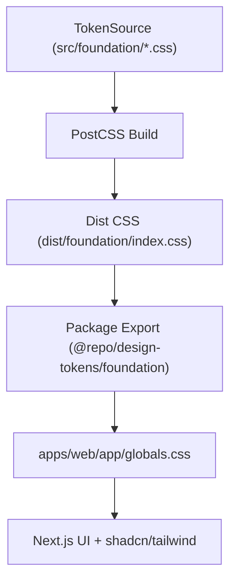

## Design Tokens Package Architecture (`packages/design-tokens`)

This document describes the architecture and conventions of the
`packages/design-tokens` package and serves as instructions for an AI agent
extending this package.

---

### High-Level Overview

- **Package type**: shared CSS design-token package in a Turborepo monorepo
- **Primary purpose**: single source of truth for visual tokens consumed by web
  apps
- **Output contract**: published CSS entrypoint `@repo/design-tokens/foundation`
  resolving to `dist/foundation/index.css`



---

### Tech Stack (Current)

- **CSS composition**: `postcss-import`
- **Build tooling**: `postcss-cli`
- **Copy utility**: `cpx` (legacy helper in scripts)
- **Package export model**: CSS-only style export via `package.json` `exports`

---

### Directory Structure

```bash
packages/design-tokens
├─ src/
│  └─ foundation/
│     ├─ index.css
│     ├─ colors.css
│     ├─ spacing.css
│     ├─ radius.css
│     └─ shadows.css
├─ dist/
│  └─ foundation/
│     └─ index.css
├─ postcss.config.cjs
└─ package.json
```

Agent rules for structure:

- Source of truth is always under `src/foundation/*`.
- `dist/*` is build output; do not manually edit it.
- Keep token files grouped by semantic domain (`colors`, `spacing`, etc.).

---

### Token Model & Naming

Current token naming convention:

- Prefix: `--ds-`
- Examples:
  - Color semantics: `--ds-background`, `--ds-primary`, `--ds-border`
  - Spacing scale: `--ds-spacing-*`
  - Radius scale: `--ds-radius-*`
  - Elevation: `--ds-shadow-*`

Theme layering:

- Base tokens in `:root`
- Dark-mode overrides in `.dark` (for colors) and media-query for shadows

Agent instructions:

- New tokens must follow `--ds-*` naming.
- Prefer semantic names over one-off component names.
- Keep dark-mode overrides consistent for visual parity.

---

### Build and Export Pipeline

Source composition:

- `src/foundation/index.css` imports token-part files.

Build command:

- `postcss src/foundation/index.css -o dist/foundation/index.css`

Consumption contract:

- `package.json` exports:
  - `./foundation` -> style `./dist/foundation/index.css`

Agent instructions:

- If adding a new token file, import it in `src/foundation/index.css`.
- Preserve `./foundation` export path compatibility to avoid downstream breaks.

---

### Integration Contract with Web Apps

Current consumer pattern:

- `apps/web/app/globals.css` imports `@repo/design-tokens/foundation`.
- Web app maps `--ds-*` variables to Tailwind/shadcn semantic variables.

Implication:

- Changes here can alter all consuming web apps simultaneously.

Agent instructions:

- Treat token changes as cross-app changes.
- Avoid destructive renames of existing tokens unless migration is included.

---

### Governance Rules

When modifying tokens:

1. Prefer additive changes (new token) over in-place breaking rename/removal.
2. If changing an existing value, assess design impact on all known consumers.
3. Keep scales coherent (spacing/radius/shadow progression should stay ordered).
4. Keep semantic color pairs aligned (`*-foreground` for readable contrast).

---

### Testing and Validation Expectations

Minimum validation for token changes:

- Build package successfully (`pnpm --filter @repo/design-tokens build`)
- Verify consumer app build still passes (`pnpm --filter web build`)
- Spot-check UI regressions in key pages/components

Agent instructions:

- Any change to exported token names requires consumer search/update in apps.
- Document migration notes when breaking changes are unavoidable.

---

### How the Agent Should Add New Tokens

1. Decide semantic category (`colors`, `spacing`, `radius`, `shadows`, or new file)
2. Add token definitions in appropriate source file
3. Import new file in `src/foundation/index.css` if new category
4. Build and validate package + primary consumer(s)
5. Update architecture/readme docs if token contract changed

---

### Do & Don’t Summary

- **Do**
  - Keep this package as the single source of truth for shared visual tokens
  - Preserve stable export contract `@repo/design-tokens/foundation`
  - Use semantic and consistent token naming
  - Validate downstream app builds after token changes
- **Don’t**
  - Don’t hardcode app-specific branding in consumer apps when a token is appropriate
  - Don’t edit `dist` files manually
  - Don’t remove widely used tokens without migration and consumer updates
