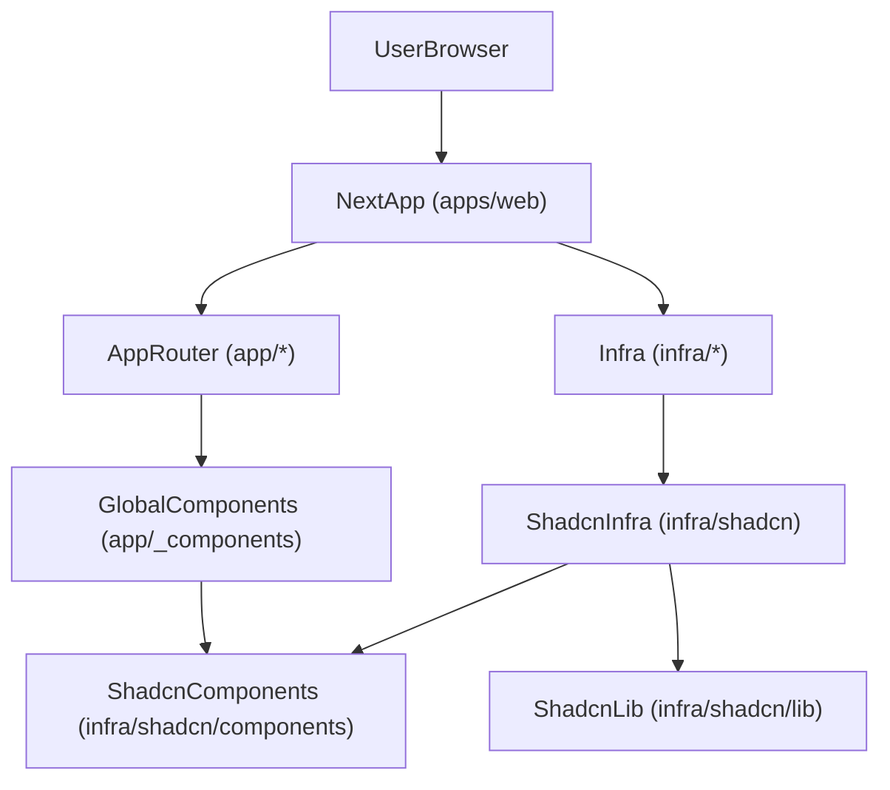

## Web App Architecture (`apps/web`)

This document describes the architecture and conventions of the `apps/web` Next.js application and serves as **instructions for an AI agent** extending this app.

---

### High-Level Overview

- **App type**: Next.js App Router application (`app/` directory)
- **Primary purpose**: Web client for a LinkedIn-style product (public web, backoffice views, authenticated UI, etc.)
- **Scope of this doc**: Only the `apps/web` app
  - Other apps and packages are documented in their own `.agents/*/ARCHITECTURE.md` files



---

### Tech Stack (Current)

- **Framework**: **Next.js 16** (App Router, `app/` directory)
- **UI library**: **React 19**
- **Component/UI ecosystem**:
  - **shadcn/ui** (local installation under `infra/shadcn`)
  - **Radix UI** (v1.4.3; shadcn dependency and direct primitives)
  - **Lucide React** (icons)
- **Styling**:
  - **Tailwind CSS** (required by shadcn/ui)
  - **Design tokens package** in the monorepo that exposes **CSS variables** consumed by this app
- **Validation**: **Zod**
- **Build tooling**: Part of a **Turborepo monorepo**

---

### Directory Structure

High-level structure of `apps/web`:

```bash
apps/web
├─ app/                          # Next.js App Router entrypoint
│  ├─ layout.*                   # Root layout(s), metadata, fonts, etc.
│  ├─ page.*                     # Root page (home, with auth gating)
│  ├─ globals.css                # Global styles, Tailwind, design tokens wiring
│  ├─ _components/               # App-level/global React components
│  │  ├─ Header/Header.tsx
│  │  ├─ Logo/Logo.tsx
│  │  ├─ UserAvatar/UserAvatar.tsx
│  │  ├─ UserDropdownMenu/UserDropdownMenu.tsx
│  │  └─ index.ts                # Barrel for global components
│  ├─ login/
│  │  └─ page.tsx                # Login page using shadcn login form
│  └─ signup/
│     └─ page.tsx                # Signup page using shadcn signup form
├─ infra/
│  └─ shadcn/
│     ├─ components/             # shadcn/ui components (including login/signup forms)
│     └─ lib/                    # shadcn/ui utilities (e.g. `cn`, `utils`)
├─ next.config.ts
├─ tailwind.config.*             # Tailwind configuration (if present)
├─ postcss.config.mjs
├─ tsconfig.json
├─ components.json               # shadcn/ui configuration
└─ package.json
```

**Agent rules for structure**:

- **`app/`**: pages, layouts, global styles, and app-level components.
- **`app/_components`**: global/shared UI components specific to this app, re-exported from `app/_components/index.ts`.
- **`infra/shadcn`**: shadcn/ui primitives and utilities (implementation of design system layer).
- **Do not** move or duplicate `infra/shadcn` into `app/`.

---

### TypeScript Config & Path Aliases (`tsconfig.json`)

The `apps/web` TypeScript config defines **path aliases** that make it clear which imports belong to the app and which belong to infra (especially shadcn):

- **`@/app/*`** → `./app/*`
- **`@/infra/*`** → `./infra/*`
- **`@/infra/shadcn/*`** → `./infra/shadcn/*`
- **`@/infra/shadcn/components/*`** → `./infra/shadcn/components/*`
- **`@/infra/shadcn/lib/*`** → `./infra/shadcn/lib/*`
- **`@/infra/shadcn/hooks/*`** → `./infra/shadcn/hooks/*`

These aliases are used throughout the app to:

- Keep **app-level imports** clearly separate from **infra-level imports**.
- Make shadcn-related imports consistently point to `infra/shadcn/...` rather than the default `app` root.

**Agent instructions**:

- When adding new imports:
  - Use `@/app/...` for **app-level code** (routes, layouts, `_components`).
  - Use `@/infra/...` for **infra-level code** (shadcn components, utilities, hooks).
- When adding new shadcn-related folders under `infra/shadcn`, update `tsconfig.json` paths **only if necessary**, keeping the same prefixing strategy (`@/infra/shadcn/...`).
- Do **not** introduce competing alias patterns (e.g. `@/ui` pointing directly into `app`) that bypass the infra separation.

---

### shadcn Configuration (`components.json`)

The `components.json` file configures shadcn/ui to generate its files under `infra/shadcn` instead of the default `app` root:

- **Tailwind configuration**:
  - `css`: `app/globals.css` (shadcn expects Tailwind + theme tokens to be defined there).
  - `cssVariables`: `true` (shadcn semantic tokens are wired as CSS variables).
- **Aliases**:
  - `components`: `@/infra/shadcn/components`
  - `utils`: `@/infra/shadcn/lib/utils`
  - `ui`: `@/infra/shadcn/components/ui`
  - `lib`: `@/infra/shadcn/lib`
  - `hooks`: `@/infra/shadcn/hooks`

This ensures that when shadcn generates or updates components, they are always placed under `infra/shadcn/...` and imported using the aliases defined in `tsconfig.json`.

**Agent instructions**:

- When using shadcn CLI to add components:
  - **Do not change** the aliases; they are already wired to `infra/shadcn`.
  - New components will appear under `infra/shadcn/components`, and should be imported via:
    - `@/infra/shadcn/components/...` or
    - `@/infra/shadcn/components/ui/...` for primitives.
- When writing app code:
  - Import shadcn primitives via `@/infra/shadcn/components/ui/...`.
  - For higher-level shadcn composites (like `LoginForm` or `SignupForm`), import them from `@/infra/shadcn/components/...`.
- Avoid wiring shadcn directly into `app` through aliases (keep the infra boundary).

---

### App Router & Component Model

- **Routing**:
  - Uses **Next.js App Router** (`app/` directory).
  - Route segments are folders under `app/`; each route has `page.tsx`.
  - Shared layout is in `app/layout.tsx`; nested routes can add their own `layout.tsx`.

- **Server vs Client Components**:
  - Components are **Server Components by default**.
  - Add `"use client"` at the top of a file to mark it as a **Client Component**.
  - Interactive UI (menus, dialogs, form interactions, etc.) should be **Client Components**, usually using shadcn + Radix.

**Agent instructions**:

- **When adding a new route**:
  - Create a folder under `app/` (e.g. `app/feed`, `app/profile`).
  - Add a `page.tsx` file.
  - Use Server Components unless you need client interactivity.
- **When building interactive UI**:
  - Use `"use client"` and compose shadcn/Radix components from `infra/shadcn`.

---

### Root Layout (`app/layout.tsx`)

The root layout:

- Imports **`app/globals.css`** to ensure Tailwind, tw-animate, and design tokens are available everywhere.
- Defines the basic HTML skeleton:
  - `<html lang="en">`
  - `<body>{children}</body>`

At this stage it is intentionally minimal, but it is the **canonical place** for:

- Global providers (theme, auth, analytics, etc.).
- Global structural wrappers that should apply to every page.

**Agent instructions**:

- Always import global styles from `app/layout.tsx` (as currently done).
- When adding cross-cutting concerns (theme providers, query clients, etc.), wire them into `RootLayout` rather than duplicating them in each page.

---

### Global Styling & Design Tokens (`app/globals.css`)

Global styling is defined in `app/globals.css` and is responsible for:

- Wiring Tailwind, animation utilities, and design tokens into the app.
- Defining the custom `dark` variant.
- Mapping **design token variables** to:
  - Tailwind token variables.
  - shadcn semantic color tokens.
- Setting base global styles.

Key imports:

- `@import 'tailwindcss';`
- `@import 'tw-animate-css';`
- `@import '@repo/design-tokens/foundation';`

Customizations:

- **Dark variant**:
  - `@custom-variant dark (&:is(.dark *));`
  - This allows a `.dark` class (defined and used by the design tokens package) to control dark mode styling.
- **Theme block**:
  - `@theme inline { ... }` defines:
    - Tailwind token variables (`--font-sans`, `--radius-*`, etc.).
    - shadcn semantic color tokens (`--color-background`, `--color-primary`, `--color-card`, etc.).
  - All of these are set to **design-token CSS variables** (e.g. `var(--ds-background)`, `var(--ds-primary)`), so the design tokens package is the single source of truth.
- **Base layer**:
  - `@layer base { ... }` applies:
    - Global border and outline behavior: `@apply border-border outline-ring/50;`
    - Global background/foreground based on shadcn semantic tokens: `bg-background text-foreground` on `body`.

**Agent instructions**:

- When introducing new visual tokens for this app, prefer:
  - Updating the **design tokens package** (so they become available as `--ds-*` variables), and
  - Wiring them in `@theme` if they should be used by Tailwind or shadcn.
- Do **not**:
  - Bypass this mapping by hardcoding colors or spacing directly in components when a token exists.
  - Introduce a separate global CSS entrypoint; keep global styles centralized in `app/globals.css`.

---

### Global App Components (`app/_components`)

- **Purpose**: Collect reusable, **app-specific** components used across multiple routes, such as:
  - **`Header`** (top nav shell)
  - **`Logo`**
  - **`UserAvatar`**
  - **`UserDropdownMenu`**
  - Shared layouts, cards, shells, page frameworks, etc.
- **Relationship to shadcn**:
  - These components **compose** shadcn primitives from `infra/shadcn/components`.
  - They **own app-specific concerns** such as:
    - When to show certain buttons, icons, or links.
    - Text copy and labels.
    - Conditional rendering based on auth state (when wired in later).
- **Current implementation**:
  - `Header`:
    - Renders a sticky top bar with border, containing `Logo` on the left and `UserDropdownMenu` on the right.
  - `Logo`:
    - Uses the `Linkedin` icon from `lucide-react` as the app logo.
  - `UserAvatar`:
    - Uses `Avatar`, `AvatarImage`, and `AvatarFallback` from `@/infra/shadcn/components/ui/avatar` to render a circular user avatar.
  - `UserDropdownMenu`:
    - Uses `DropdownMenu` primitives and `Button` from `@/infra/shadcn/components/ui/...` plus Lucide icons (`BadgeCheckIcon`, `BellIcon`, `LogOutIcon`) to build a user menu with account, notifications, and sign-out entries.
  - All of these are exported via `app/_components/index.ts` for convenient importing across the app.

**Agent instructions**:

- **Place global, app-wide components in `app/_components`** and export them from `app/_components/index.ts`.
- **Do not** re-implement low-level UI primitives here; wrap shadcn primitives instead.
- If a component is **purely primitive** and reusable across apps, it belongs in `infra` (or a shared package), not in `app/components`.

When creating **new global app components** (e.g. `MainShell`, `Sidebar`, `TopNav`):

- Put them under `app/_components/...` following the existing folder structure.
- Use shadcn primitives from `@/infra/shadcn/components/ui/...` as building blocks.
- Keep them focused on layout and composition rather than business logic.

---

### Root Page & Auth Gating (`app/page.tsx`)

The root page (`app/page.tsx`) currently:

- Imports `Header` from `@/app/_components`.
- Mocks an `isAuthenticated` flag (set to `true` for now).
- Redirects unauthenticated users to `/login` using `redirect` from `next/navigation`.
- Renders:
  - `<Header />`
  - A placeholder `<main>main</main>` block for the main app content.

This is intended to be a **Server Component** that will later:

- Check authentication via the `api-auth` app (JWT-based auth).
- Use real auth state instead of the mock `isAuthenticated` variable.

**Agent instructions**:

- Treat this file as the **entrypoint for the authenticated shell** of the app.
- When wiring real auth:
  - Replace the mock `isAuthenticated` flag with server-side calls to the auth microservice.
  - Keep the redirect pattern (`redirect('/login')`) for unauthenticated users.
- Use `Header` and other global components from `app/_components` to frame the main content.

---

### Auth Pages: Login & Signup (`app/login`, `app/signup`)

Auth-specific pages are currently implemented as:

- `app/login/page.tsx`:
  - Imports `LoginForm` from `@/infra/shadcn/components/login-form`.
  - Centers the form within a flex container.
- `app/signup/page.tsx`:
  - Imports `SignupForm` from `@/infra/shadcn/components/signup-form`.
  - Uses the same centered layout pattern as the login page.

These pages intentionally **consume infra-level shadcn composites** (`LoginForm`, `SignupForm`) directly, rather than re-implementing form fields at the app level.

**Agent instructions**:

- When creating new auth-related pages (e.g. reset password, verify email):
  - Follow the same pattern:
    - Route folder under `app/` with `page.tsx`.
    - Centered layout using Tailwind utilities.
    - Compose from infra-level shadcn components where possible.
- If a new form is required:
  - Implement the **form primitive/composite** under `infra/shadcn/components/...`.
  - Use it from the route’s `page.tsx`.

---

### shadcn / UI Infra (`infra/shadcn`)

- **Location**: `infra/shadcn`
  - `infra/shadcn/components`: all shadcn-generated components
  - `infra/shadcn/lib`: shadcn utilities (e.g. `cn` helper, theme helpers)

- **Role**:
  - This folder represents the **implementation of the design-system layer** for this app.
  - It should contain **generic primitives** (buttons, inputs, dialogs, dropdowns, etc.), not app business logic.

**Agent instructions**:

- **When you need a primitive UI** (e.g., button, input, dialog, dropdown):
  - First check if there is a matching component in `infra/shadcn/components`.
  - If it exists:
    - Import and use it directly, or wrap it in an app-specific component in `app/components`.
  - If it does not exist:
    - Add a new component under `infra/shadcn/components`, following shadcn conventions.
    - Keep it **generic**, without app-specific labels, copy, or logic.
- **Do NOT**:
  - Move `infra/shadcn` into `app/`.
  - Scatter shadcn components into other directories.

---

### Styling & Design Tokens

- **Tailwind CSS**:
  - Used as the main styling utility layer.
  - Integrated as required by shadcn/ui.
- **Design Tokens**:
  - A separate monorepo package exports design tokens as **CSS variables**.
  - This app **consumes** those variables; it does _not_ define them.
  - Typical usage: `var(--color-primary)`, `var(--spacing-xs)`, etc.

**Agent instructions**:

- **Preferred style source**:
  - Use **design tokens via CSS variables** for colors, spacing, typography, radii, etc.
- **Tailwind integration**:
  - Prefer Tailwind classes whose values are wired to tokens (if configured).
  - If needed, combine custom properties with Tailwind (e.g. utility classes + a small `style` / custom class using `var(...)`).
- **Avoid**:
  - Hardcoded color values (like `#123456`) or magic spacing values when a token exists.
  - Introducing an alternative styling system (e.g. CSS-in-JS libraries) without explicit instruction.

---

### Validation with Zod

- **Usage**:
  - Define **Zod schemas** for data structures used in forms, API responses, and other critical boundaries.
  - Use `z.infer` to derive TypeScript types from these schemas, keeping runtime and types in sync.

**Agent instructions**:

- For new features that include **forms or data models**:
  - Create or reuse a Zod schema for that domain.
  - Validate user input or external data with this schema at boundaries (e.g. on form submit or after fetching data).
  - Use the inferred type from the schema in components and logic.

---

### Data Fetching & APIs (Forward-Looking)

> Note: The exact back-end APIs and auth flows may be defined elsewhere (e.g. `.agents/api-auth/ARCHITECTURE.md`). This section defines **how this web app should integrate** once APIs exist.

**Agent instructions (general pattern)**:

- **Server-side data fetching**:
  - Prefer using **Server Components** and async `page.tsx` / `layout.tsx` components that call data-fetching functions.
  - Encapsulate fetch logic in small reusable functions or services (e.g. `getFeed`, `getUserProfile`) that live near the route or in a dedicated folder (to be defined when backend is ready).
- **Client-side data fetching** (only when needed):
  - Use Client Components and appropriate client data libraries (to be chosen) _only_ when server rendering is insufficient (e.g. live updates, in-page mutations).
- **Validation at the boundary**:
  - Validate API responses with **Zod** where appropriate.
- **Auth**:
  - Follow the conventions defined by the auth app/package (see that architecture doc once it exists).
  - Keep auth logic centralized; avoid scattering low-level auth calls across many components.

---

### How the Agent Should Add a New Feature

This is a **step-by-step checklist** for the agent when implementing a new feature in `apps/web`.

#### 1. Define the Feature Surface

- **Clarify**:
  - Which **route(s)** are involved (e.g. new page under `app/profile`, extension of `app/page`, etc.).
  - Which **UI elements** are global (belong in `app/components`) vs page-specific (belong in route-specific folders).

#### 2. Plan Routes and Layouts

- **If a new top-level page is needed**:
  - Create a folder in `app/` (e.g. `app/profile`).
  - Add `page.tsx` for the route.
  - If the page requires a custom layout shared by its children, also add `layout.tsx`.

- **If extending an existing page**:
  - Modify the existing route component under `app/...`.

#### 3. Design the UI with the Design System

- **Identify primitives needed**: button, card, input, dialog, dropdown, avatar, etc.
- **Check `infra/shadcn/components`**:
  - If the primitive exists: use it.
  - If missing: add it there, following shadcn patterns.
- **Compose app-specific components**:
  - For reusable feature-specific components (e.g. `ConnectionCard`, `FeedPostCard`), create them under:
    - `app/components` if they are truly cross-route and global.
    - The relevant route folder (e.g. `app/feed/_components`) if they are local to that feature.

#### 4. Wire Styling with Tokens

- Use **design tokens via CSS variables** (directly or via Tailwind configuration).
- Make sure colors, spacing, typography, and radii come from these tokens, not hardcoded literals.

#### 5. Add Data & Validation

- If the feature **fetches data**:
  - Prefer server-side fetching in the route or in a helper used by the route.
- If the feature includes **forms or user input**:
  - Create/extend a **Zod schema** for the input.
  - Validate data on submit and use inferred types.

#### 6. Keep Infra and App Concerns Separate

- **Infra (`infra/shadcn`)**:
  - Only generic primitives and utilities.
- **App (`app/`)**:
  - Feature logic, business rules, copy, and composition.

---

### Conventions & Best Practices

- **Imports**:
  - App components and routes:
    - Use app-level aliases (e.g. `@/app/_components/Header/Header` or `@/app/_components`) as configured.
  - shadcn components:
    - Import from `infra/shadcn/components` (e.g. `@/infra/shadcn/components/login-form`) or from `infra/shadcn/components/ui` (e.g. `@/infra/shadcn/components/ui/button`).
- **Naming**:
  - Components in `app/_components`: descriptive, app-oriented (`Header`, `MainShell`, `UserMenu`).
  - Components in `infra/shadcn/components`: primitive-oriented (`Button`, `Input`, `Dialog`, etc.).
- **Code organization**:
  - Keep related components and logic close to their routes when they are not global.
  - Avoid very large monolithic components; prefer small, focused ones.

---

### Do & Don’t Summary for the Agent

- **Do**:
  - **Use App Router conventions** for new routes and layouts.
  - **Create global app components** in `app/_components` that wrap shadcn primitives.
  - **Add or reuse** shadcn components in `infra/shadcn/components` for primitive UI needs.
  - **Use the existing TS path aliases** (`@/app/*`, `@/infra/shadcn/*`, etc.) instead of introducing new, overlapping aliases.
  - **Keep global styles in `app/globals.css`**, including Tailwind imports and design-token mappings.
  - **Use Zod** for new forms and data models.
  - **Use design tokens (CSS variables)** for visual design values.
  - **Keep infra and app concerns separate**.

- **Don’t**:
  - Don’t move, copy, or scatter `infra/shadcn` into other folders.
  - Don’t hardcode colors/spacing/typography that should come from tokens.
  - Don’t bypass the design-token layer by introducing separate global CSS variables for the same concepts.
  - Don’t change `components.json` aliases or `tsconfig` paths casually; they coordinate shadcn’s file generation and import structure.
  - Don’t introduce new, overlapping validation or styling libraries without explicit instruction.
  - Don’t mix business logic into infra-level components.

---

### Future Extensions (For Later Iterations)

- **Routing & Navigation**:
  - Define the full navigation structure for feed, profile, messaging, notifications, settings, etc.
- **Cross-Cutting Concerns**:
  - Theming (light/dark), internationalization, accessibility, analytics.
- **Shared Modules**:
  - Once patterns stabilize, consider extracting common UI and logic into shared packages documented under `.agents/*`.

This document should be kept **up to date** whenever the structure of `apps/web` changes or new cross-cutting patterns (routing, theming, data fetching) are introduced.
