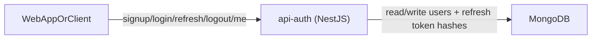

# API Auth (`apps/api-auth`) 🔐

`api-auth` is the authentication service of this monorepo. Its role is to
protect user sessions and provide a clear token lifecycle: signup, login,
access validation, refresh validation, and logout invalidation. In practical
terms, this API is the identity boundary used by clients (especially `web`) to
know who is authenticated and to safely access protected resources.

This service interacts directly with MongoDB for persistence and exposes HTTP
endpoints consumed by frontend or other internal clients. It does not try to
solve business domains outside authentication; instead, it focuses on identity,
credential validation, token issuance, and secure token revocation behavior.

---

## 🌐 Service Interactions

`api-auth` integrates with:

- **Web client (`apps/web`)** as a consumer of auth endpoints
- **MongoDB** as the persistence layer for users and refresh-token hashes
- **JWT clients** (any HTTP consumer using bearer tokens)

### Interaction map



---

## 🛠️ Framework and Technology Choices

This service uses **NestJS** because it provides a structured module-based
backend model that fits very well with layered architecture and explicit
dependency boundaries. Nest’s DI container, module system, and guards make it
easier to keep authentication flows organized while preserving testability.

Persistence is handled with **Mongoose + MongoDB**, a pragmatic match for this
scope because user and refresh-token data are straightforward document models.
Security-sensitive operations use **JWT** and **bcrypt**, while boundary input
validation is handled with **Zod pipes** to reject malformed payloads early and
consistently.

### Main stack

- NestJS
- Mongoose + MongoDB
- JWT (`@nestjs/jwt`)
- bcrypt
- Zod
- Jest + Supertest

---

## 🗂️ Folder Structure

```bash
apps/api-auth
├─ src/
│  ├─ common/
│  │  └─ env.ts
│  ├─ auth/
│  │  ├─ domain/
│  │  │  ├─ entities/
│  │  │  ├─ ports/
│  │  │  └─ value-objects/
│  │  ├─ application/
│  │  │  └─ use-cases/
│  │  ├─ interface/
│  │  │  ├─ dto/
│  │  │  ├─ http/
│  │  │  └─ pipes/
│  │  ├─ infra/
│  │  │  ├─ mappers/
│  │  │  └─ mongoose/
│  │  │     ├─ adapters/
│  │  │     └─ schemas/
│  │  └─ auth.module.ts
│  ├─ app.module.ts
│  └─ main.ts
├─ .env.template
└─ package.json
```

---

## 🧠 Architecture Approaches

### Clean Architecture

This service is organized so business rules are not tied to framework details.
Domain concepts (like user identity and auth invariants) remain independent from
HTTP, MongoDB, and infrastructure concerns. Application use-cases orchestrate
flows, while interface and infra layers adapt the outer world into domain-safe
operations. The result is a codebase where behavior stays stable even if
transport or persistence implementation changes.

### Hexagonal Architecture

The API follows a ports-first model where the core defines contracts and outer
layers implement them. Instead of coupling use-cases to Mongoose models,
domain/application layers rely on abstract ports (`UserPort`,
`RefreshTokenPort`). This keeps the center of the system independent and easier
to reason about because each external dependency must pass through a deliberate
adapter boundary.

> [IMAGE PLACEHOLDER: Hexagonal Architecture diagram]

### Ports and Adapters

Ports are the expected capabilities required by the core (for example, finding
a user by email or storing refresh-token hashes). Adapters are concrete
implementations, such as `MongooseUserAdapter` and
`MongooseRefreshTokenAdapter`. This pattern gives you freedom to replace
infrastructure details later without rewriting core authentication behavior and
makes tests cleaner because ports can be mocked or replaced in-memory.

> [IMAGE PLACEHOLDER: Ports and Adapters diagram]

### Domain-Driven Design (DDD)

DDD here appears in a tactical, practical form: explicit domain objects,
language-rich types, and invariant enforcement close to domain intent. Value
Objects like `Email`, `Password`, and `UserId` prevent invalid states at the
entry point, instead of letting primitive strings leak into sensitive flows.
This makes auth rules easier to understand and safer to evolve over time.

---

## 🧩 Design Patterns Used

### Use Case Pattern

Authentication actions are modeled as dedicated use-cases (`SignupUseCase`,
`LoginUseCase`, `RefreshTokenUseCase`, `LogoutUseCase`, `MeUseCase`). Each one
represents a user-intent operation with explicit input and output behavior. This
pattern keeps controllers thin and avoids turning route handlers into large
procedural scripts, while making each flow independently testable and easier to
maintain.

### Guard Pattern (Access Control)

Protected route access is enforced through `AccessTokenGuard`, which centralizes
bearer-token extraction and verification before protected handlers run. Instead
of duplicating token checks across endpoints, the guard acts as a reusable
access gate. This reduces security drift, improves consistency, and keeps
authorization concerns out of business flow orchestration.

### Fail-Fast Configuration Pattern

Environment configuration uses strict required-env helpers and fails at startup
if mandatory values are missing or invalid. This prevents “half-running”
environments with hidden misconfiguration and makes failures explicit and early.
For authentication services, this is important because silent fallback behavior
around secrets and expirations can create unpredictable or unsafe runtime states.

### Secure Refresh-Token Persistence Pattern

Refresh tokens are never persisted in plain text. Instead, a hash is stored and
checked during refresh/logout operations. This mirrors password storage
principles and reduces blast radius if storage is compromised. Combined with
expiration checks and deletion on logout, it provides a practical, defense-aware
token lifecycle strategy for this service.

> [IMAGE PLACEHOLDER: Refresh token lifecycle and persistence flow]

---

## 🔌 HTTP Contract

Base path: `/auth`

| Method | Route | Purpose |
| --- | --- | --- |
| `POST` | `/auth/signup` | Create user account |
| `POST` | `/auth/login` | Authenticate and issue tokens |
| `POST` | `/auth/refresh` | Validate refresh token and return new access token |
| `POST` | `/auth/logout` | Invalidate refresh-token persistence |
| `GET` | `/auth/me` | Return current authenticated user profile |

---

## ⚙️ Environment Variables

Reference template: [`apps/api-auth/.env.template`](./.env.template)

Required variables:

- `PORT`
- `MONGO_URI`
- `JWT_SECRET`
- `JWT_EXPIRES_IN`
- `JWT_REFRESH_SECRET`
- `JWT_REFRESH_EXPIRES_IN`

---

## 🧪 Run and Validate This App

From repository root:

```bash
# run only this app in dev mode (workspace script)
pnpm --filter api-auth dev

# build
pnpm --filter api-auth build

# tests
pnpm --filter api-auth test
```

If using Docker Compose for full integration:

```bash
docker compose up -d --build api-auth mongo
docker compose ps
```

Quick smoke flow:

```bash
pnpm validation:api:auth:flow
```

---

## 📚 Related References

- [Monorepo README](../../README.md)
- [Auth Architecture Blueprint](../../.agents/api-auth/ARCHITECTURE.md)
