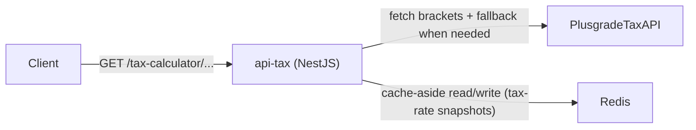

# API Tax (`apps/api-tax`) 🧾

`api-tax` is the tax-calculation service of this monorepo. It acts as an
intermediate layer between client applications and the Plusgrade interview tax
API, adding domain validation, resilient upstream handling, deterministic tax
calculation behavior, and Redis-backed caching for tax rates.

Instead of exposing external API instability directly to consumers, this service
transforms external tax bracket payloads into validated domain models and
returns predictable responses for tax-year and salary scenarios required by the
interview challenge.

---

## 🌐 Service Interactions

`api-tax` integrates with:

- **Clients** (web or HTTP consumers) calling tax-calculation endpoints
- **Plusgrade mock API** (`/tax-calculator/*`) as upstream data provider
- **Redis** for tax-rate snapshot cache

### Interaction map



---

## 🛠️ Framework and Technology Choices

This service uses **NestJS** to keep API boundaries explicit and to support a
clean modular architecture where controllers, use-cases, and adapters are
clearly separated. Nest’s module and DI model is especially useful here because
the service depends on interchangeable ports for external-tax retrieval and
caching.

Tax bracket retrieval uses **Axios** to integrate with the upstream Plusgrade
API, while **Redis (`ioredis`)** is used for cache-aside storage of normalized
tax-rate snapshots. The calculation behavior and integration safety are covered
with **Jest + Supertest**, enabling repeatable verification of both domain math
and HTTP contract behavior.

### Main stack

- NestJS
- Axios
- Redis (`ioredis`)
- Jest + Supertest

---

## 🗂️ Folder Structure

```bash
apps/api-tax
├─ src/
│  ├─ tax/
│  │  ├─ domain/
│  │  │  ├─ ports/
│  │  │  ├─ services/
│  │  │  └─ value-objects/
│  │  ├─ application/
│  │  │  └─ use-cases/
│  │  ├─ interface/
│  │  │  ├─ dto/
│  │  │  ├─ http/
│  │  │  └─ pipes/
│  │  ├─ infra/
│  │  │  ├─ plusgrade/
│  │  │  │  ├─ adapters/
│  │  │  │  └─ http/
│  │  │  └─ redis/
│  │  │     └─ adapters/
│  │  └─ tax.module.ts
│  ├─ app.module.ts
│  └─ main.ts
├─ .env.template
└─ package.json
```

---

## 🧠 Architecture Approaches

### Clean Architecture

The core objective of this service is to preserve tax domain behavior
independently of infrastructure details. Controllers receive validated inputs,
application use-cases orchestrate flows, and domain services/value objects own
the calculation invariants. Infra-level implementation (external API and cache)
stays behind explicit contracts so business behavior remains stable even if
upstream or storage mechanisms evolve.

### Hexagonal Architecture

The service uses a hexagonal mindset by isolating business logic in the center
and interacting with external systems only through ports. `TaxRatePort` and
`CachePort` define required capabilities, while adapters provide concrete
behavior for Plusgrade HTTP access and Redis operations. This avoids hard
coupling between use-cases and infrastructure clients.

> [IMAGE PLACEHOLDER: Hexagonal Architecture diagram]

### Ports and Adapters

In practice, `PlusgradeTaxRateAdapter` implements how tax brackets are fetched
and normalized, while `RedisCacheAdapter` implements cache persistence mechanics.
Application use-cases never call Axios or Redis directly; they depend on ports
and receive data in domain-friendly forms. This keeps the service easier to test
and safer to refactor when integration details change.

> [IMAGE PLACEHOLDER: Ports and Adapters diagram]

### Domain-Driven Design (DDD)

DDD appears here through tactical modeling with Value Objects that protect
invariants at creation time. `TaxYear` enforces supported years, `Salary`
enforces non-negative values, and tax bracket/rate objects validate domain
consistency before any calculation happens. This makes invalid states hard to
represent and keeps tax behavior aligned with explicit domain language.

---

## 🧩 Design Patterns Used

### Cache-Aside Pattern (Redis)

Tax rate retrieval follows cache-aside flow: the use-case first checks Redis for
a cached tax-rate snapshot, then falls back to the tax-rate port when cache is
missing, and finally writes the normalized result back with a configured TTL.
This reduces repeated upstream calls while preserving deterministic responses and
keeps caching policy centralized in use-case orchestration rather than spread
across controller or adapter code.

> [IMAGE PLACEHOLDER: Cache-Aside flow with Redis]

### Retry + Fallback Resilience Pattern

Upstream retrieval applies retry/backoff for unstable calls and introduces a
dedicated fallback behavior for year `2022` by querying the stable
`/tax-calculator/` endpoint when needed. This design handles known interview API
instability without leaking random external failures directly as business logic.
It improves reliability while still surfacing meaningful HTTP errors when limits
are exceeded.

### Use Case Pattern

Core actions are organized as explicit use-cases:
`GetTaxRateByYearUseCase` and `CalculateTaxUseCase`. This pattern keeps route
handlers thin, keeps orchestration explicit, and allows focused testing of tax
retrieval and tax computation behavior separately. As a result, each change can
be validated where it belongs, instead of mixing transport, integration, and
domain concerns in the same function.

### Fail-Fast Configuration Pattern

The service validates required environment variables as numbers/strings at
startup and during component initialization. Missing or invalid config causes
immediate failure instead of runtime fallback defaults. For this API, fail-fast
behavior is especially important to avoid silent misconfiguration around cache
TTL, retry parameters, and external endpoint location.

---

## 🔌 HTTP Contract

Base path: `/tax-calculator`

| Method | Route | Purpose |
| --- | --- | --- |
| `GET` | `/tax-year/:year` | Return normalized tax rate brackets for the year |
| `GET` | `/tax-year/:year/salary/:salary` | Return tax calculation result for year + salary |

---

## ⚙️ Environment Variables

Reference template: [`apps/api-tax/.env.template`](./.env.template)

Required variables:

- `PORT`
- `REDIS_URL`
- `PLUSGRADE_TAX_API_BASE_URL`
- `PLUSGRADE_API_TIMEOUT_MS`
- `PLUSGRADE_API_MAX_RETRIES`
- `PLUSGRADE_API_RETRY_BACKOFF_MS`
- `TAX_RATE_CACHE_TTL_SECONDS`

---

## 🧪 Run and Validate This App

From repository root:

```bash
# run only this app in dev mode
pnpm --filter api-tax dev

# build
pnpm --filter api-tax build

# tests
pnpm --filter api-tax test
```

If using Docker Compose:

```bash
docker compose up -d --build api-tax redis plusgrade-api
docker compose ps
```

Quick verification:

```bash
curl -s http://localhost:7001/tax-calculator/tax-year/2022
curl -s http://localhost:7001/tax-calculator/tax-year/2022/salary/100000
```

Interview scenario checks:

```bash
curl -s http://localhost:7001/tax-calculator/tax-year/2022/salary/0
curl -s http://localhost:7001/tax-calculator/tax-year/2022/salary/50000
curl -s http://localhost:7001/tax-calculator/tax-year/2022/salary/100000
curl -s http://localhost:7001/tax-calculator/tax-year/2022/salary/1234567
```

Expected totals:

- Salary `0` ➜ `totalTax = 0`
- Salary `50000` ➜ `totalTax = 7500`
- Salary `100000` ➜ `totalTax = 17739.17`
- Salary `1234567` ➜ `totalTax = 385587.65`

Negative checks:

```bash
curl -i http://localhost:7001/tax-calculator/tax-year/2018/salary/100000
curl -i http://localhost:7001/tax-calculator/tax-year/2022/salary/-1
```

Expected status:

- Invalid year (`2018`) ➜ `400`
- Invalid salary (`-1`) ➜ `400`

---

## 📚 Related References

- [Monorepo README](../../README.md)
- [Tax Architecture Blueprint](../../.agents/api-tax/ARCHITECTURE.md)
