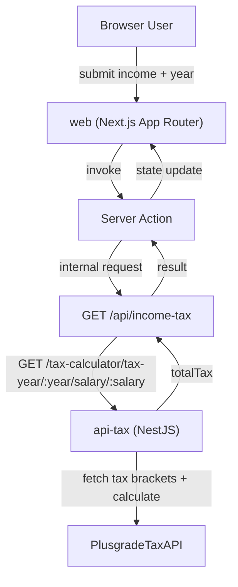

# Web App (`apps/web`) 🌐

`web` is the Next.js user interface for this monorepo. It provides the user
experience for tax calculation and authentication screens while keeping UI
composition, feature logic, and infrastructure primitives clearly separated.

The app uses App Router with server-first rendering, server actions for form
workflows, and route handlers as internal HTTP boundaries. This keeps browser
interactions simple while preserving typed validation and controlled integration
with backend APIs.

---

## 🌐 Service Interactions

`web` integrates with:

- **Users** in browser
- **api-tax** for tax calculation
- **Plusgrade API** indirectly through `api-tax`

### Interaction map



---

## 🛠️ Framework and Technology Choices

This app uses **Next.js App Router** and **React 19** to support a server-first
rendering model with clear boundaries between server and client execution.
Feature logic is validated with **Zod**, internal and external HTTP calls are
handled with **Axios**, and UI foundations are built with **shadcn/ui**
primitives on top of **Radix UI** patterns and **Tailwind CSS**.

The `infra/shadcn` layer is intentionally isolated from `app/_features` and
`app/_components` so design-system primitives can evolve independently from
feature behavior.

### Main stack

- Next.js (App Router)
- React 19 + Server Components + Server Actions
- TypeScript
- Zod
- Axios
- shadcn/ui + Radix patterns
- Tailwind CSS
- `@repo/design-tokens` (workspace package)
- Axiom SDK (`@axiomhq/nextjs`)

---

## 🗂️ Folder Structure

Source layout follows **feature colocation** under `app/_features/<feature>` and
**infra separation** under `infra/` (shadcn UI primitives + Axiom observability).

Route segments like `login/` and `signup/` **repeat this pattern** per page: each has
`page.tsx`, optional `_components/`, and `_features/*`:

```bash
apps/web
├─ app/
│  ├─ layout.tsx
│  ├─ page.tsx
│  ├─ globals.css
│  ├─ api/
│  │  └─ income-tax/
│  │     └─ route.ts
│  ├─ login/
│  │  ├─ page.tsx
│  │  ├─ _components/
│  │  └─ _features/
│  │     ├─ login/
│  │     └─ forgot-password/
│  ├─ signup/
│  │  ├─ page.tsx
│  │  ├─ _components/
│  │  └─ _features/
│  │     └─ signup/
│  ├─ _components/
│  │  ├─ index.ts
│  │  ├─ Header/
│  │  │  └─ Header.tsx
│  │  ├─ Logo/
│  │  │  └─ Logo.tsx
│  │  ├─ UserAvatar/
│  │  │  └─ UserAvatar.tsx
│  │  └─ UserDropdownMenu/
│  │     └─ UserDropdownMenu.tsx
│  └─ _features/
│     └─ income-tax/
│        ├─ actions/
│        ├─ domain/
│        ├─ errors/
│        └─ ui/
├─ infra/
│  ├─ axiom/
│  └─ shadcn/
└─ package.json
```

---

## 🧠 Architecture Approaches

### App Router + Server-First Composition

Route segments in `app/` own page composition and server concerns. The home
route reads URL search parameters (`income`, `year`) and renders the tax
calculator with server-provided defaults.

### Colocation by Feature

Each feature keeps related code together under `app/_features/<feature>`:

- `domain/` for schema + types
- `actions/` for server actions and integration calls
- `errors/` for feature-specific error factories and enums (e.g. UI error mapping)
- `ui/` for React components specific to that feature

This improves maintainability by reducing cross-folder coupling and keeping
domain validation and error handling close to consumers.

### Validation Boundary with Zod

The same `incomeTaxInputSchema` is reused in:

- Client submit pre-check (`IncomeTaxForm`)
- Server action boundary (`calculateIncomeTaxAction`)
- Route handler boundary (`app/api/income-tax/route.ts`)

This layered validation keeps invalid data from crossing boundaries and avoids
duplicated validation logic with drifting behavior.

### Infra Separation (shadcn + Axiom)

The `infra/` folder holds shared infrastructure:

- **`infra/shadcn`**: reusable UI primitives and generic auth forms (login/signup).
- **`infra/axiom`**: observability (logger, log levels, event enums) for server-side
  tracing and Axiom integration.

App-level components and feature widgets live under `app/*`. This separation
keeps infrastructure implementation details isolated from product feature
behavior and page orchestration.

### Error Boundary Strategy

`IncomeTaxResultErrorBoundary` protects rendering of result UI blocks. If a
render-time crash occurs in the result subtree, the user sees a local fallback
with a retry button rather than a full-page failure.

---

## 🔄 Request Flow (Isolated Action ➜ API Route ➜ api-tax ➜ Plusgrade)

1. User enters `income` and `year` and submits the form.
2. `calculateIncomeTaxAction` (server action) validates input via Zod.
3. Action calls `requestIncomeTax`, targeting internal route
   `/api/income-tax`.
4. `app/api/income-tax/route.ts` validates again and requests `api-tax`.
5. `api-tax` queries Plusgrade endpoints, applies tax logic, and returns
   `totalTax`.
6. Internal route maps response into `{ result }`.
7. Server action returns updated state to the client component.
8. UI renders skeleton, error, or final computed tax value.

This staged flow keeps responsibilities clean:

- **Server action:** form orchestration + state contract
- **Internal API route:** integration boundary + transport mapping
- **api-tax:** tax domain + upstream resilience
- **Plusgrade API:** bracket data source

---

## 🧩 UI Behavior (Complete Walkthrough)

### Home (`/`)

- Renders a sticky header with Plusgrade logo and user dropdown.
- Shows an `Income Tax Calculator` card centered in the viewport.
- Accepts prefilled values from query params (`income`, `year`).
- Submits through server action and renders:
  - loading skeleton while pending
  - inline form validation errors
  - inline form-level integration errors
  - formatted tax total (`$xx.xx`) on success

### Income Tax Form UX

- Inputs are digit-sanitized on change.
- Client-side validation blocks invalid submissions immediately.
- Server-side validation enforces rules again for trust boundaries.
- Submit button enters pending state (`Calculating...`) during request.

### Result + Failure UX

- `IncomeTaxResult` renders a bordered result panel on success.
- Integration failures show a destructive-styled message block.
- `IncomeTaxResultErrorBoundary` catches render exceptions in result subtree and
  displays retry fallback UI.

### Auth Screens

- `/login` renders `LoginForm` based on shadcn card/field primitives.
- `/signup` renders `SignupForm` with multi-field account creation UI.
- These screens currently provide presentation scaffolding and navigation links
  (`login` ⇄ `signup`) ready for API wiring.

---

## 🔌 Internal HTTP Contract

### `GET /api/income-tax`

Query params:

- `income` (numeric string)
- `year` (4-digit numeric string between 2000 and 2100)

Success response:

```json
{ "result": 17739.17 }
```

Error response:

```json
{ "error": "message" }
```

---

## 🧪 Run and Validate This App

From repository root:

```bash
# run only web app
pnpm --filter web dev

# build
pnpm --filter web build

# production start
pnpm --filter web start
```

Manual UI checks:

1. Open `http://localhost:3000`
2. Enter `income=100000` and `year=2022`
3. Submit and confirm result shows `17739.17`
4. Try invalid year (`1999`) and confirm validation error
5. Open `http://localhost:3000/login` and `http://localhost:3000/signup`

---

## 📈 Axiom

`web` emits structured server-side observability events to Axiom around:

- action-level network failures
- internal route validation failures
- upstream `api-tax` failures

All events include a propagated `x-request-id` value to support cross-service
correlation.

---


## 🧪 Cypress

---

## 📚 Related References

- [Monorepo README](../../README.md)
- [Web Architecture Blueprint](../../.agents/web/ARCHITECTURE.md)
- [API Tax README](../api-tax/README.md)
